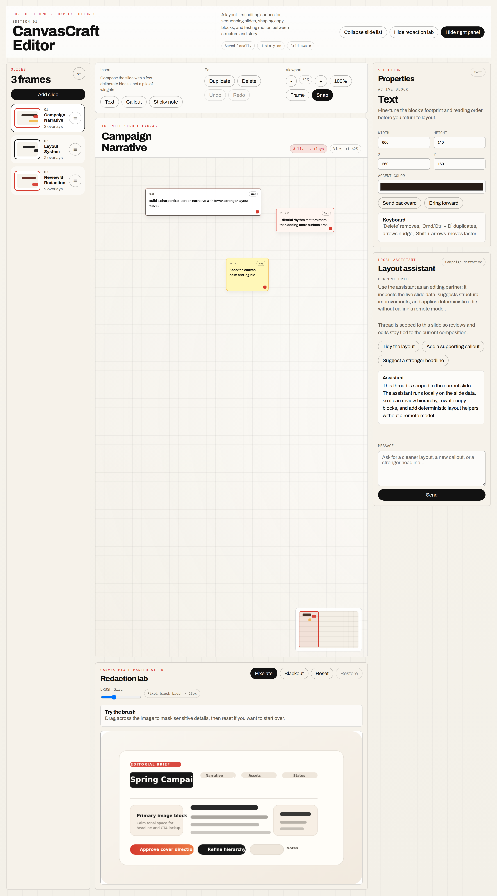
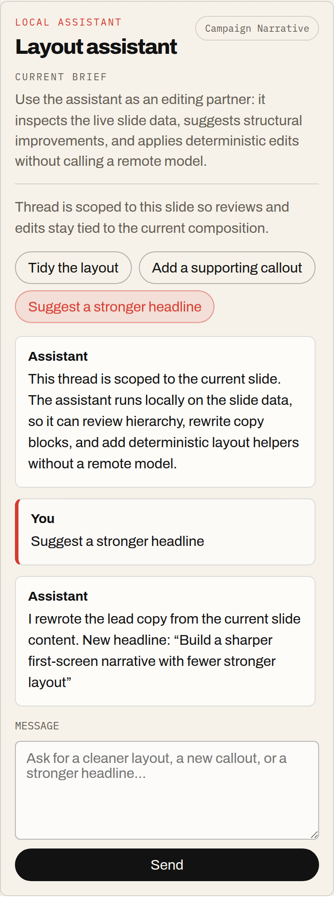
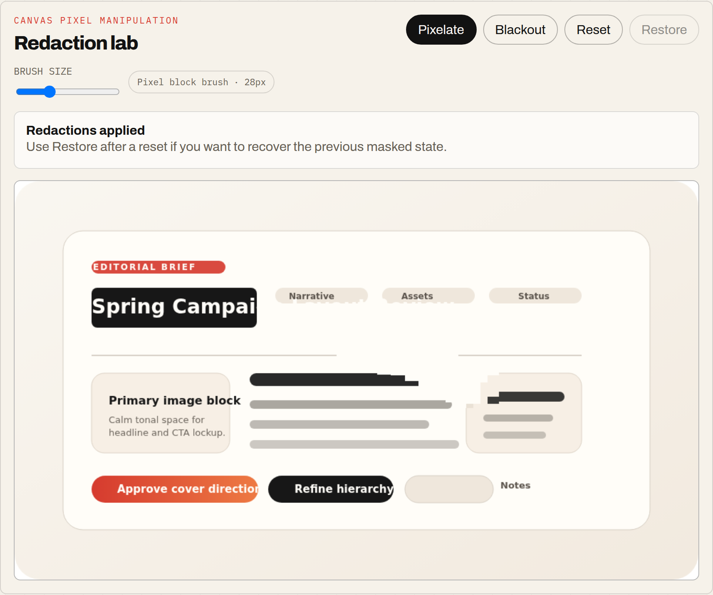

# CanvasCraft Editor

CanvasCraft Editor is a complex editor-style web app I built with React and TypeScript to showcase direct-manipulation UI work: sortable slides, a large canvas workspace, inline editing, layout controls, redaction tooling, and a local assistant that can review and adjust the active slide.

I wrote this project as a portfolio piece to demonstrate the kind of frontend engineering I enjoy most: interaction-heavy product UI that goes beyond static pages and requires careful state management, input handling, and component architecture.

## Project description

This project simulates a presentation and content-composition tool where a user can:

- manage slides from a collapsible sortable rail
- edit content directly on a large scrollable canvas
- drag, resize, layer, and rearrange overlay blocks
- use a properties panel to fine-tune selected elements
- redact sensitive content with canvas-based image tools
- get deterministic layout help from a local assistant

I structured it like a production-style React application rather than a one-file prototype, so the editor logic, UI surface, persistence, and test coverage are easier to understand and extend.

## Preview

### Full editor overview



### Local layout assistant



### Redaction workflow



## Stack

- React
- TypeScript
- Vite
- dnd-kit
- native Canvas API

> Note: I packaged this repo with Vite for frictionless local testing, but the editor shell is client-side React code that ports directly into a Next.js route or app-shell environment.

## What this project highlights

With this project, I wanted to show strength in:

- interactive editor UI, not just static pages
- direct-manipulation interfaces with drag behavior
- componentized React architecture
- canvas-based tooling for image workflows
- local assistant workflows that coexist with complex layouts
- maintainable TypeScript code in a non-trivial UI

## Features

### 1. Collapsible slide list
The left sidebar supports:
- collapse / expand behavior
- sortable slide cards using `dnd-kit`
- active slide selection
- quick slide creation

### 2. Infinite-scroll canvas
The main workspace is a large scrollable canvas with:
- draggable overlay blocks
- resize handles
- inline editing using `contentEditable`
- multiple overlay types (`text`, `callout`, `sticky`)
- selection and delete actions
- zoom, fit-to-view, a minimap, and snapping support

### 3. Redaction lab
The lower panel handles image editing on a canvas using:
- pixelation brush
- blackout brush
- reset capability
- direct `ImageData` manipulation

### 4. Local assistant panel
The right-hand assistant panel:
- keeps per-slide chat history
- offers quick layout actions
- can review the current slide from live local state
- can rewrite headlines, add support blocks, and reorganize layouts
- changes the editor layout when opened or closed

### 5. Production-style quality pass
I also included:
- local persistence via `localStorage`
- undo / redo history
- keyboard shortcuts for duplicate, delete, deselect, and nudging
- a selected-object properties panel
- automated regression tests plus an accessibility smoke check

## Local setup

```bash
npm install
npm run dev
```

Open:

```bash
http://localhost:4177
```

The project ignores generated output and dependencies via `.gitignore`, so the repo stays focused on source files plus the lockfile.

For a production build:

```bash
npm run build
npm run preview
```

For validation:

```bash
npm run check
```

## Notes on implementation

- `dnd-kit` was used for sortable slide management.
- Freeform overlay dragging was implemented with direct pointer math because editor-style interactions usually need tighter control than list-oriented drag-and-drop abstractions.
- React was used to build the full editor shell: slide rail, canvas workspace, inline editing, assistant panel, and redaction tool UI.
